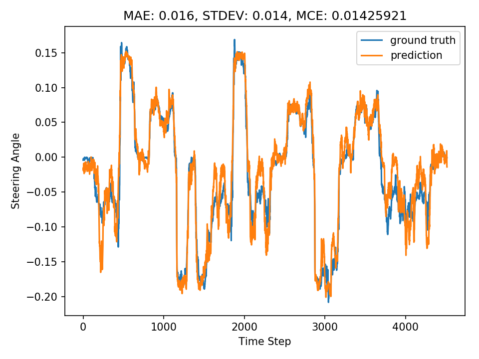

# 레포지토리 설치
레포지토리 설치한 위치를 잘 확인할 것.
```sh
pwd
```
를 입력하여 설치하는 위치를 잘 기억해둔 다음 아래 명령어 실행.
```sh
git clone https://github.com/ICSL-Capstone/oscar --recursive
```
<br>

이후 아래 명령어를 실행하여 아나콘다 가상환경을 구성
```sh
conda env create --file config/conda/environment.yaml
```
<br>

설치 후 아래 명령어를 실행하여 가상환경으로 전환
```sh
conda activate oscar
```

<br>
<br>

# 모델 학습 방법

```sh
python neural_net/train.py 데이터셋_경로
```
<br>

## example 
---
데이터셋의 폴더이름이 *2021-05-18-15-25-54* 이고  
본인이 받은 데이터셋의 경로가 */home/icsl/dataset/* 에 있을때,  
csv 파일의 경로는 
```sh
/home/icsl/dataset/2021-05-18-15-25-54/2021-05-18-15-25-54.csv
```
처럼 될것임.  <br>

이때 아래와 같이 csv가 들어있는 폴더 경로를 입력해주면 됨.  
```sh
python neural_net/train.py /home/icsl/dataset/2021-05-18-15-25-54
```

### #주의#
위 명령어를 실행하는 위치는 oscar 폴더(설치한 레포지토리) 내에서 실행해야함.  
즉, 터미널창에
```sh
pwd
```
입력시 나오는 경로가 레포지토리가 설치된 위치가 맞는지 확인할 것.

만약 현재 위치가 레포지토리가 설치된 위치가 아니라면, cd 명령어로 설치한 폴더로 이동
```sh
cd oscar_레포지토리가_설치된_경로
```
ex)
```sh
cd /home/kdh/oscar
```


---
<br><br>


# 학습된 모델 테스트 방법
```
python neural_net/drive_log.py 학습모델_파일경로 테스트데이터셋_경로
```

## example
본인이 받은 테스트 데이터셋의 폴더이름이 *2021-05-17-22-20-35* 이고  
테스트 데이터셋의 경로가 */home/icsl/dataset/* 에 있을때,  
csv 파일의 경로는 
```sh
/home/icsl/dataset/2021-05-17-22-20-35/2021-05-17-22-20-35.csv
```

처럼 될것임.  <br>

또한 학습이 완료된 모델은 학습 데이터셋이 있는 경로에 저장되므로  
예제의 경우 */home/icsl/dataset* 경로에  
*2021-05-18-15-25-54_fusion_kdh_jaerock3_N1.h5*  
의 이름으로 저장되어있을것임.  


이때 아래와 같이 "모델 weight 파일의 경로"와 "테스트 데이터셋의 csv가 들어있는 폴더 경로"를 입력해주면 됨.  
```sh
python neural_net/drive_log.py /home/icsl/dataset/2021-05-18-15-25-54_fusion_kdh_jaerock3_N1 /home/icsl/dataset/2021-05-17-22-20-35
```

모델 weight 파일의 경로의 경우는  
*/home/icsl/dataset/*  
이지만, 위 명령어처럼 **확장자를 제외한 weight 파일의 이름**도 추가로 작성하여야함.

해당 명령어를 실행하면 모델을 분석한 결과이미지들이 아래와 같은 형식의 파일명으로 생성됨.  
*2021-05-17-22-20-35_N1_OOOOOOOO.png*  

이미지에 나와있는 MAE가 뭔지는 찾아볼것. MCE는 안나오면 무시해도됨.
